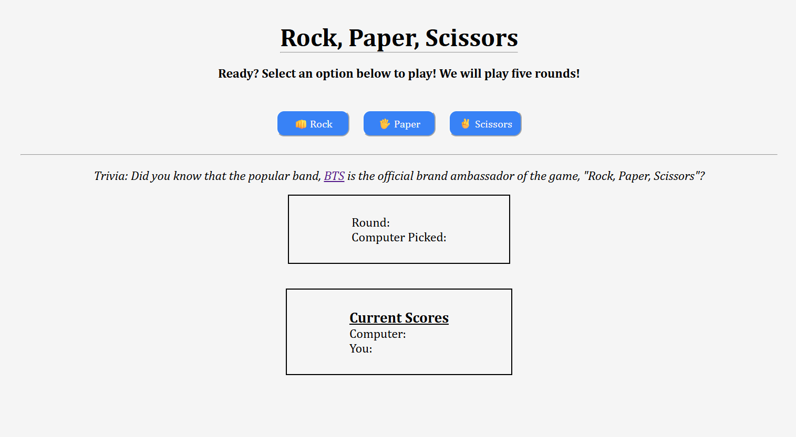
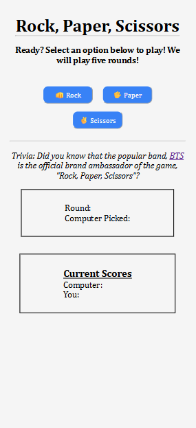
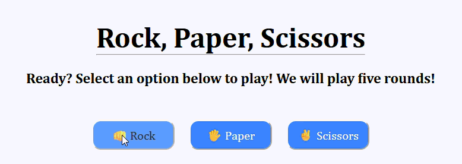
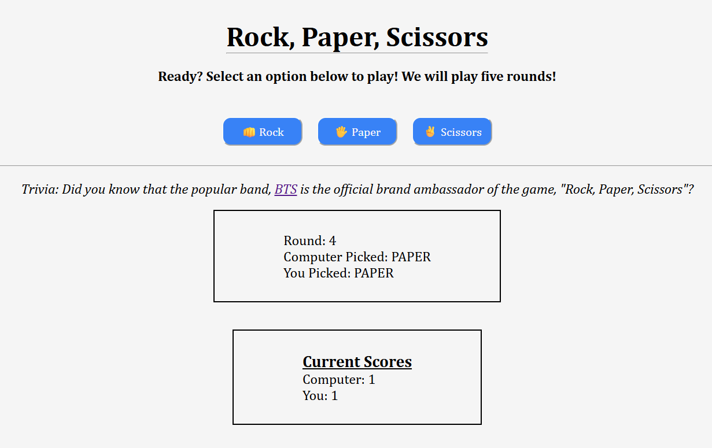
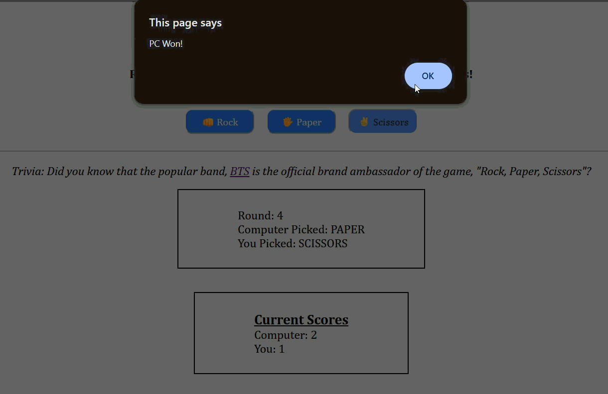
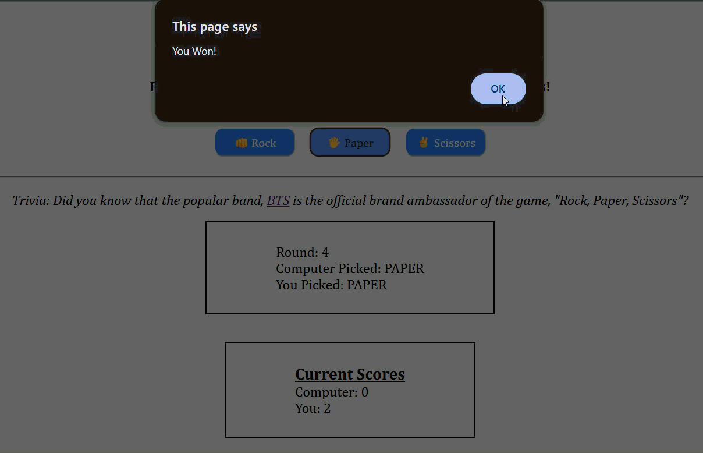
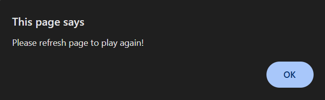
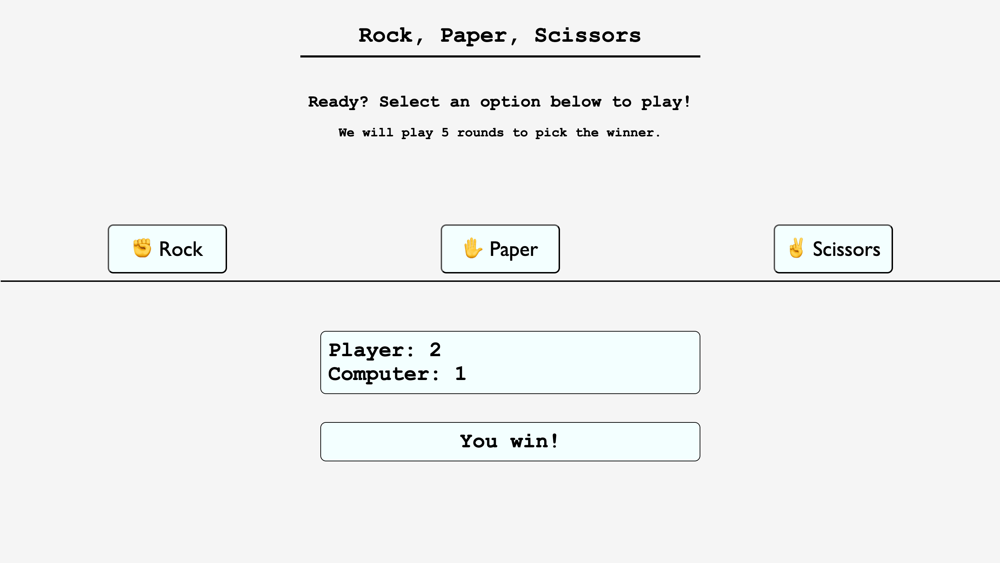

# Rock, Paper, Scissors!

Attempted a simple visual gameplay of the popular game `Rock, Paper & Scissors`
Wanted to revise the following:
* HTML
* CSS
* HTML & CSS Layouts- FlexBox, Standard, etc.
* JavaScript

## Update: Welcome to Rock, Paper, Scissors 2.0
This is how the updated game landing page looks:

This is how it looks on mobile/smaller devices:

Added effects to the gameplay:
* Buttons show effect when the user hovers over them

* User is alerted of who won, each round
* The game tracks each round's scores

* There is confettie animation when the game ends with a winner.

* The game ends after 5 rounds and the user is prompted to refresh the page to try again. The buttons are disabled until the page is refreshed.

The image below shows the original game layout.

